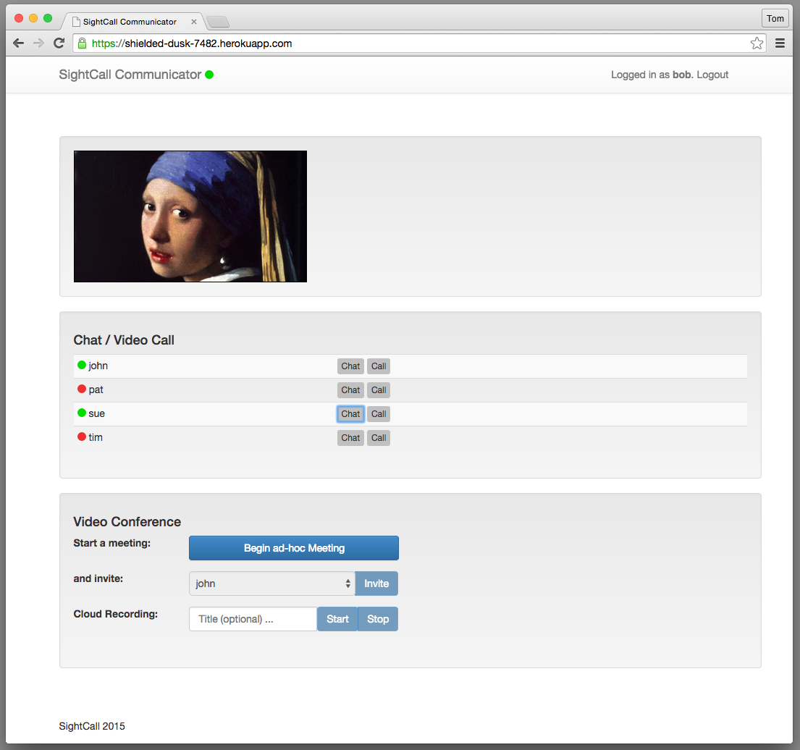
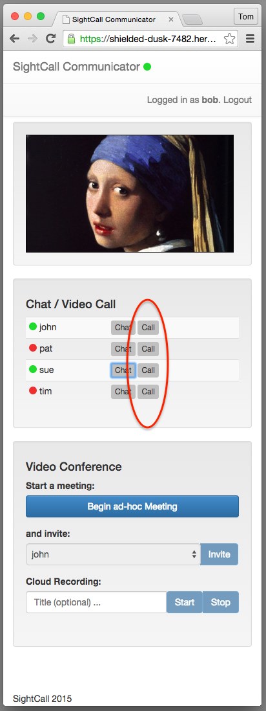
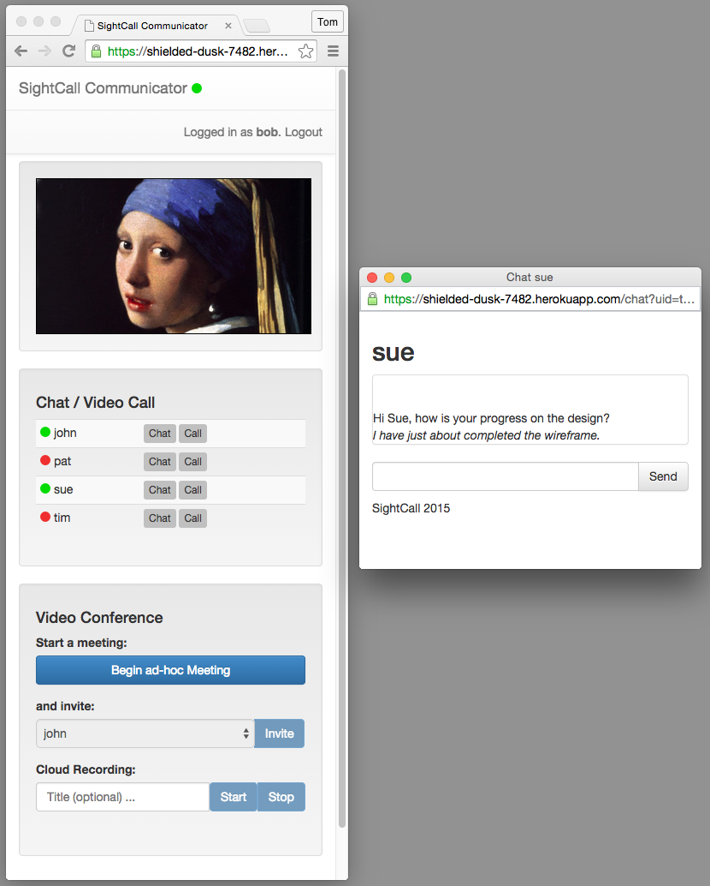
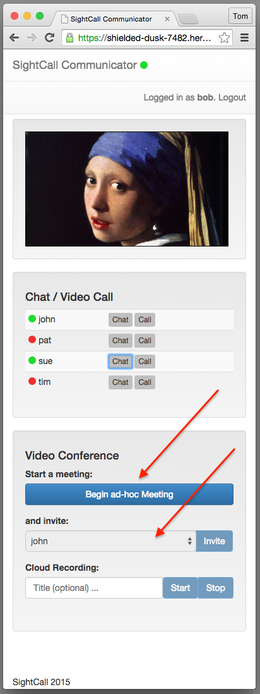

SightCall Communicator
======================

SightCall Communicator is a **reference implementation** for a web
application showcasing real-time communications for a small workgroup.
It is implemented as essentially a
[Single-Page Web-Application](http://en.wikipedia.org/wiki/Single-page_application).
Communicator demonstrates real-time services and shows how to layer
them onto a base web application using the SightCall platform.

- one-to-one video and voice
- multiparty video-teleconference
- text-chat
- presence
- recording (optional)

SightCall Communicator has been created using common web technologies
([Rails](http://rubyonrails.org/),
[Bootstrap](http://getbootstrap.com), [jQuery](http://jquery.com/)),
and is purposely kept small so that it can serve as a starting point
for a complete project.  It is not only a showcase of SightCall
technologies, it is also a tutorial of best-practices and idioms to
use for embedding SightCall features into your own site.

Communicator is easy to clone and run on your own servers, or you can
try it out by deploying on [Heroku](http://heroku.com).  (Even a free/hobby account on
Heroku will suffice.)  Read on.



#### And Mobile Too!

See also
[Communicator-for-Android](https://github.com/sightcall/Communicator-for-Android),
a mobile App that you can run on Android.


## Run It On Heroku

You can run your own instance of SightCall Communicator on Heroku in
just a few minutes.

- Clone this repository so you can customize it.  Move into the new directory.

```sh
    % git clone git@github.com:sightcall/Communicator.git
    % cd Communicator
```

- If you have not already, you must request an API KEY and credentials from SightCall.
  Get it here: [http://www.sightcall.com/developers/](http://www.sightcall.com/developers/).

- Put the files `client.p12` and `authCA.crt` in the `/certs` directory.  Commit them in to the local copy of the repository.

```sh
    % cd certs
    % git add client.p12
    % git add authCA.crt
    % git commit -m "add the certs"
```

- Unpack your `client.p12` file into its two components.

```sh
    % openssl pkcs12 -in client.p12 -nocerts -out privateKey.pem
    % openssl pkcs12 -in client.p12 -clcerts -nokeys -out publicCert.pem
```

- Check these two files into the `/certs` directory as well.

```sh
    % git add privateKey.pem
    % git add publicCert.pem
    % git commit -m "add the unpacked certs"
```

- Move back up to the home directory of Communicator to be ready for the `heroku` commands to follow.

```sh
    % cd ..
```


- Create a new Heroku project for this demo.

```sh
    % heroku create
```

Note the URL of the project you just created.  (E.g. https://your-app-1234.herokuapp.com)

- Push the code to Heroku

```sh
    % git push heroku master
```

- Run the `bootstrap` task (in file lib/tasks/bootstrap.rake).  This
  creates the database and the default users.  If you would like to
  customize the default users, you can edit the task before you invoke
  it.

```sh
    % heroku run bundle exec rake bootstrap
```

- Set the following Heroku environment variables **exactly** as shown below.

```sh
    % heroku config:set RTCC_AUTH_URL=https://auth.rtccloud.net/auth/
    % heroku config:set RTCC_CACERT=certs/authCA.crt
    % heroku config:set RTCC_CLIENTCERT=certs/publicCert.pem
    % heroku config:set RTCC_CLIENTCERT_KEY=certs/privateKey.pem
```

- Set the following Heroku environment variables as appropriate for your SightCall account.

```sh
    % heroku config:set RTCC_APP_ID=ab01cd34ef56
    % heroku config:set RTCC_CERTPASSWORD=abcdefgh
    % heroku config:set RTCC_CLIENT_ID=7a7a7a7a7a8b8b8b8b8b9c9c9c9c9c
    % heroku config:set RTCC_CLIENT_SECRET=19ab19ab19ab19ab28cd28cd28cd28
```

Visit the application at your Heroku URL and log-in as one of the
pre-defined users to test it out.  Have one of your friends log-in as
one of the other pre-defined users and test making and receiving video
calls and using text chat.

- bob / bobpassword
- john / johnpassword
- pat / patpassword
- sue / suepassword
- tim / timpassword


## Provision additional Users

This little web application does not have an administrator interface, so you can use the command
line interface with the Rails console to manipulate its database.

You can add users like this.

```sh
    % heroku run bin/rails console
    > User.new(:name => "new user", :password => "new password").save
```

Be sure not to forget the **.save**!

You can delete and list users like this.

```sh
    % heroku run bin/rails console
    > User.find_by_name("bob").destroy
    > User.all
```


## Add the Recording Feature

Contact SightCall if you are interested in Recording video calls.  We
can provide you with a CloudRecorder token.  Once you receive it, add
it to your Communicator project this way.

```sh
    % heroku config:set CLOUDRECORDER_TOKEN=xxyyxxyy27331b82ef0e8fa9bfe37fcb
```


## Customize It

Most of this single-page application is defined in the file:
`app/views/call/index.html.erb`.  The elements of the page and their
layout is defined using Twitter Bootstrap classes.  All of the
Javascript implementing Communicator is defined in this one file, with
the exception of a few reusable classes in `app/assets/javascripts`.

The page layout is defined in `app/views/layout/application.html.erb`.
This is the file that defines the navigation header and application
name.  The online connection status area is also defined here.

The SightCall user definitions are in file `app/model/user.rb`.  Edit
this file to change user profiles (SightCall 'premium' versus 'standard') or the
logic that selects their domain ('yourdomain.com').


## Short Feature Overview

This application shows how to connect to the SightCall cloud, and how
to use some of the main features of the SightCall Realtime Platform.

### Check your online status

A green check-mark means you're ready to go and the you are connected
to the SightCall Realtime Platform.


### Make a one to one call

Note the presence status of your contacts.  Select a contact and
initiate a one-to-one call.  SightCall's signaling platform notifies
your contact and Communicator displays an alert asking them to answer
the call.



### Use text chat

Select a contact and press the `Chat` button to begin a text chat.
SightCall's real-time platform handles chat messaging.  Communicator
shows how to use pop-up windows to keep each conversation in a
separate window.  (Please disable your pop-up blocker when prompted!)




### Set up a multiparty conference call

Press the `Begin ad-hoc Meeting` button to set up a conference call.
For each contact you would like to invite, select them from the list
and press the `Invite` button.  SightCall's signaling platform
notifies each invitee and Communicator will display an alert asking
them to join the conference.




Conferences can be recorded by the SightCall Cloud Recorder.  If you
have enabled this feature, you can enter a Title for your recording
and press "Start."


## Best Practices for using SightCall

The Realtime logic of SightCall Communicator resides in a single file:
`app/views/call/index.html`.  This file is a good reference for coming
up to speed on how to connect to the platform and use it.


## Reusable Components

A few small Javascript classes are defined in
`app/assets/javascripts`.  The `chat_manager` takes care of sending
and receiving chat messages, and routing them to the right window for
display.  The `cloudrecorder_manager` wraps the Ajax calls to the
proxy methods of the CloudRecorder.  The proxy methods themselves are
defined in `app/controllers/cloudrecorder_controller.rb`.

